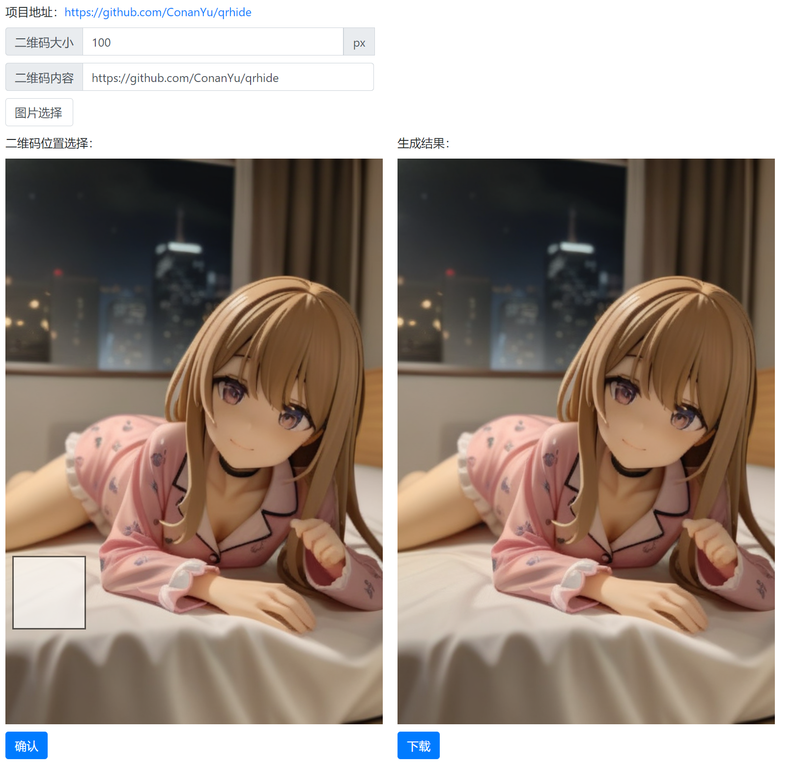
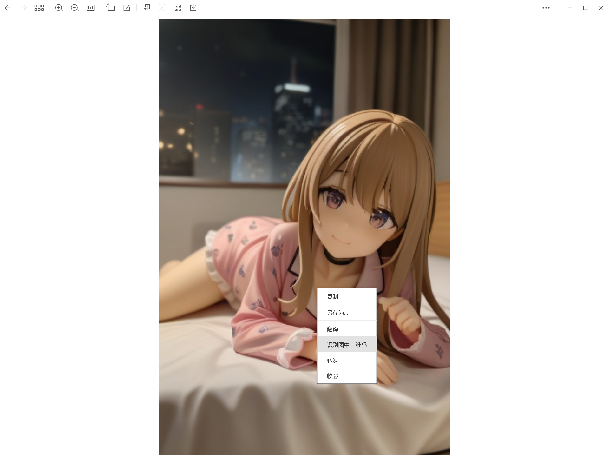

纯前端实现生成肉眼不可见但微信可扫的带二维码图片。

（上面选择的图片由StableDiffusion生成，模型地址：[https://civitai.com/models/338712/pvc-style-modelmovable-figure-model-xl](https://civitai.com/models/338712/pvc-style-modelmovable-figure-model-xl)）

在微信中可以到识别二维码，肉眼不可见：

在Windows11默认的照片软件黑色背景下看这个图片可以看到二维码：

本项目是由[偶尔有点小迷糊的视频](https://www.bilibili.com/video/BV1Yu4m1T7B8)启发而来，原作者项目地址：[https://github.com/3150601355/pic_hide_barcode](https://github.com/3150601355/pic_hide_barcode)。
